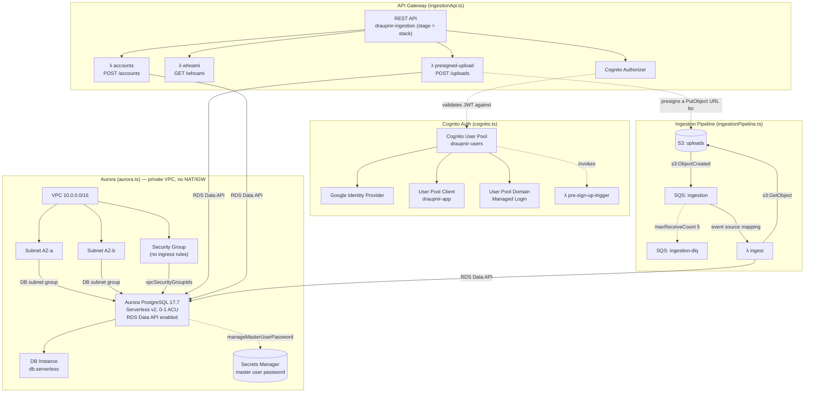

# AWS Architecture

High-level view of the resources provisioned by the Pulumi stack in `infra/` (see `infra/index.ts` and `infra/lib/*`). Supporting resources are omitted below for readability, including: IAM roles/policies and Lambda invoke permissions (one role per Lambda — note that `dataApiPolicyStatements` grants the same Data API actions, including transactions/batch writes, to every DB-backed route even though only `ingest` uses transactions), `ManagedLoginBranding`, the API Gateway `Deployment`/`Stage`, the RDS `SubnetGroup`, and the SQS queue policy/S3 bucket notification/Lambda event source mapping (shown only as the edges they wire up).

## Notes

- **No direct network path to Aurora.** Every DB-backed Lambda talks to the cluster exclusively through the RDS Data API's HTTPS endpoint (ADR-0003) — the security group has no ingress rules, and the VPC has no NAT/internet gateway.
- **Aurora scales to zero** (`minCapacity: 0`, `secondsUntilAutoPause: 300`) — near-zero idle cost, at the price of a resume delay (seconds to ~1 minute) on the first request after idle. DB-backed API routes are given a 29s timeout (API Gateway's ceiling without a quota increase) to absorb this.
- **`whoami`** is the one API route that doesn't touch Aurora or S3 — no DB/bucket environment variables, no extra IAM policy statements beyond basic Lambda execution.
- Deletion protection + a final snapshot are enabled on the Aurora cluster since it holds live account/transaction data.

See the ADRs in `docs/adr/` for the reasoning behind these choices, and `infra/lib/*.ts` for the resource definitions.
